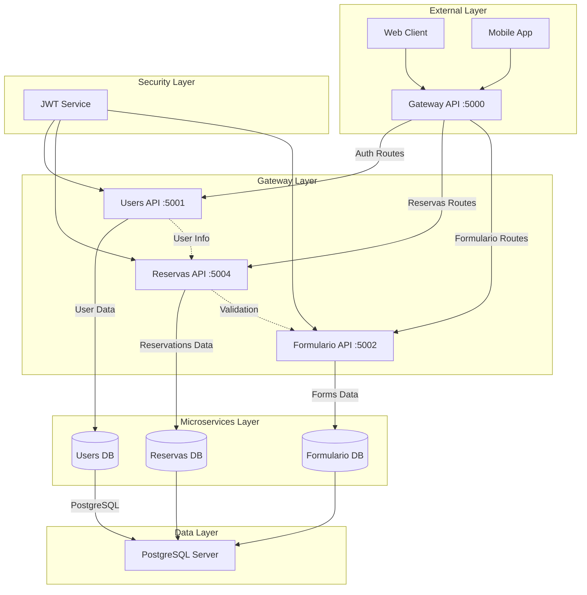
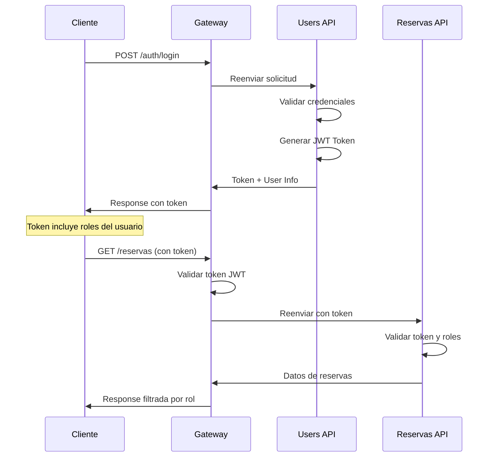
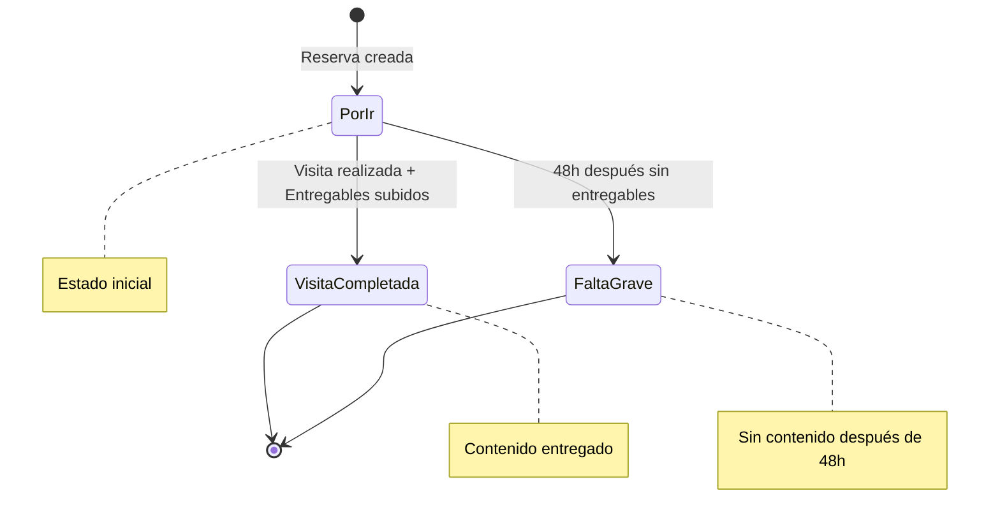

# 🚀 FoodiesBNB Backend - Microservices Architecture

<div align="center">
  
  
  
  
  
</div>

<div align="center">
  <h3>🏗️ Arquitectura de Microservicios para Gestión de Reservas Gastronómicas</h3>
  <p><strong>Sistema Backend Distribuido con .NET 9, PostgreSQL y Gateway YARP</strong></p>
</div>

---

## 👨‍💻 **Autor**

**Jhoel Suárez**  
*Ingeniero de Software*  
📧 [Contacto](mailto:jhoel@foodiesbnb.com) | 💼 [LinkedIn](https://linkedin.com/in/jhoel-suarez)

---

## 📖 **Descripción del Sistema**

FoodiesBNB Backend es una arquitectura de microservicios robusta desarrollada en **.NET 9** que gestiona la lógica de negocio para una plataforma de reservas gastronómicas. El sistema conecta microinfluencers con restaurantes mediante APIs especializadas, autenticación JWT y gestión avanzada de datos.

### 🎯 **Características Principales**

- 🏗️ **Arquitectura de Microservicios** independientes y escalables
- 🔐 **Autenticación JWT** con roles y permisos granulares
- 🗄️ **Base de Datos PostgreSQL** con migraciones automáticas
- 🚪 **API Gateway YARP** para enrutamiento y balanceado
- 📊 **Gestión de Reservas** con lógica de negocio avanzada
- 👥 **Sistema de Usuarios** con múltiples roles
- 📝 **Formularios Dinámicos** para restaurantes
- 🔄 **Patrones CQRS** y Repository
- 📈 **Logging y Monitoreo** integrado

---

## 🏗️ **Arquitectura del Sistema**



### 🗂️ **Estructura del Proyecto**

```
FoodiesBackWEB/
├── 📁 GatewayApi/                  # API Gateway con YARP
│   ├── Program.cs                  # Configuración del Gateway
│   ├── appsettings.json           # Rutas y configuración
│   └── Helpers/
│       └── ErrorAuthMiddleware.cs  # Middleware de errores
├── 📁 UsersApi/                    # Microservicio de Usuarios
│   ├── Controllers/
│   │   ├── AuthController.cs       # Autenticación JWT
│   │   └── UsersController.cs      # CRUD de usuarios
│   ├── Data/
│   │   ├── UsersDbContext.cs       # Contexto EF Core
│   │   └── Repositories/           # Patrón Repository
│   ├── Models/                     # Entidades de dominio
│   ├── Services/                   # Lógica de negocio
│   ├── Helpers/
│   │   ├── PasswordHelper.cs       # Hashing de passwords
│   │   └── TokenHelper.cs          # Generación JWT
│   └── Migrations/                 # Migraciones de BD
├── 📁 ReservasApi/                 # Microservicio de Reservas
│   ├── Controllers/
│   │   ├── ReservasController.cs   # CRUD de reservas
│   │   └── EntregablesController.cs # Gestión de entregables
│   ├── Data/
│   │   ├── ReservasDbContext.cs    # Contexto EF Core
│   │   └── Repositories/           # Repositorios especializados
│   ├── Models/
│   │   ├── Reserva.cs              # Entidad principal
│   │   └── Entregable.cs           # Contenido de influencers
│   ├── Services/
│   │   ├── ReservaService.cs       # Lógica de reservas
│   │   ├── UserApiService.cs       # Comunicación entre APIs
│   │   └── Interfaces/             # Contratos de servicios
│   ├── Dtos/                       # Data Transfer Objects
│   │   ├── Request/                # DTOs de entrada
│   │   └── Response/               # DTOs de respuesta
│   └── Migrations/                 # Migraciones de BD
├── 📁 FormularioFoodieApi/         # Microservicio de Formularios
│   ├── Controllers/
│   │   └── FormularioFoodieController.cs # Gestión de formularios
│   ├── Data/
│   │   └── FormularioFoodieDbContext.cs # Contexto EF Core
│   ├── Models/
│   │   └── FormularioFoodie.cs     # Formularios de restaurantes
│   └── Services/                   # Servicios de negocio
└── 📄 test-roles.http             # Tests HTTP para APIs
```

---

## 🔧 **Tecnologías y Stack Técnico**

### **Framework y Runtime**
- **.NET 9** - Framework principal
- **ASP.NET Core** - APIs REST
- **Entity Framework Core** - ORM para PostgreSQL
- **C# 12** - Lenguaje de programación

### **Base de Datos**
- **PostgreSQL 15+** - Base de datos principal
- **Npgsql** - Driver para PostgreSQL
- **Entity Framework Migrations** - Versionado de BD

### **Seguridad y Autenticación**
- **JWT Bearer Tokens** - Autenticación stateless
- **BCrypt** - Hashing de passwords
- **Role-based Authorization** - Control de acceso

### **Gateway y Proxy**
- **YARP (Yet Another Reverse Proxy)** - API Gateway
- **Load Balancing** - Distribución de carga
- **Route Configuration** - Enrutamiento dinámico

### **Herramientas de Desarrollo**
- **Swagger/OpenAPI** - Documentación de APIs
- **Serilog** - Logging estructurado
- **Docker** - Containerización

---

## ⚙️ **Instalación y Configuración**

### **Prerrequisitos**
- .NET 9 SDK
- PostgreSQL 15+
- Visual Studio 2022 / VS Code
- Docker (opcional)

### **Configuración de Base de Datos**

```sql
-- Crear bases de datos
CREATE DATABASE "UsersDb";
CREATE DATABASE "ReservasDb";
CREATE DATABASE "FormularioFoodieDb";

-- Crear usuario para las aplicaciones
CREATE USER foodies_app WITH PASSWORD 'Jardines118';
GRANT ALL PRIVILEGES ON DATABASE "UsersDb" TO foodies_app;
GRANT ALL PRIVILEGES ON DATABASE "ReservasDb" TO foodies_app;
GRANT ALL PRIVILEGES ON DATABASE "FormularioFoodieDb" TO foodies_app;
```

### **Configuración de Conexiones**

```json
// appsettings.json para cada microservicio
{
  "ConnectionStrings": {
    "ConnectionDataBase": "Host=localhost;Port=5432;Database=UsersDb;SslMode=Disable;Username=postgres;Password=Jardines118"
  },
  "Jwt": {
    "SecretKey": "mi-clave-secreta-super-segura-de-32-caracteres-minimo-para-jwt-tokens-2024",
    "Issuer": "http://localhost:5001",
    "Audience": "foodies-api",
    "ExpirationMinutes": "60"
  }
}
```

---

## 🚀 **Ejecución del Sistema**

### **Orden de Ejecución de Microservicios**

```bash
# 1. Users API (Puerto 5001)
cd UsersApi
dotnet run

# 2. Reservas API (Puerto 5004)
cd ReservasApi
dotnet run

# 3. Formulario API (Puerto 5002)
cd FormularioFoodieApi
dotnet run

# 4. Gateway API (Puerto 5000) - Último
cd GatewayApi
dotnet run
```

### **Scripts de Desarrollo**

```bash
# Restaurar dependencias en todos los proyectos
dotnet restore

# Compilar todos los proyectos
dotnet build

# Ejecutar migraciones
dotnet ef database update --project UsersApi
dotnet ef database update --project ReservasApi
dotnet ef database update --project FormularioFoodieApi

# Ejecutar tests
dotnet test
```

---

## 🔐 **Sistema de Autenticación y Autorización**

### **Flujo de Autenticación JWT**



### **Roles del Sistema**

| Rol | Descripción | Permisos |
|-----|-------------|----------|
| **usuario** | Usuario básico registrado | Acceso limitado |
| **foodie** | Microinfluencer gastronómico | Crear reservas, subir contenido |
| **restaurante** | Propietario de restaurante | Dashboard, gestión de reservas |
| **admin** | Administrador del sistema | Acceso completo |

### **Implementación de Roles**

```csharp
// Autorización basada en roles
[Authorize(Roles = "restaurante,Admin")]
public async Task<IActionResult> GetByRestaurante()
{
    var usuarioId = GetUsuarioIdFromToken();
    var restauranteRole = User.Claims
        .FirstOrDefault(c => c.Type == ClaimTypes.Role && c.Value != "restaurante");
    
    var nombreRestaurante = restauranteRole.Value;
    var reservas = await _reservaService.GetReservasByRestauranteAsync(nombreRestaurante);
    return Ok(reservas);
}
```

---

## 🗄️ **Modelos de Datos y Entidades**

### **Users API - Modelo de Usuario**

```csharp
public class Usuario
{
    public int Id { get; set; }
    public string Nombre { get; set; }
    public string Apellido { get; set; }
    public string Correo { get; set; }
    public string PasswordHash { get; set; }
    public bool Activo { get; set; }
    public DateTime FechaCreacion { get; set; }
    public List<Rol> Roles { get; set; } = new List<Rol>();
}

public class Rol
{
    public int Id { get; set; }
    public string Nombre { get; set; }
    public string Descripcion { get; set; }
    public List<Usuario> Usuarios { get; set; } = new List<Usuario>();
}
```

### **Reservas API - Modelo de Reserva**

```csharp
public class Reserva
{
    public int Id { get; set; }
    public int UsuarioId { get; set; }
    public string NombreLocal { get; set; }
    public DateTime Fecha { get; set; }
    public string Hora { get; set; }
    public int NumeroPersonas { get; set; }
    public string EstadoReserva { get; set; } // "Por Ir", "Visita Completada", "Falta Grave"
    public DateTime FechaCreacion { get; set; }
    public DateTime? FechaActualizacion { get; set; }
    public List<Entregable> Entregables { get; set; } = new List<Entregable>();
}

public class Entregable
{
    public int Id { get; set; }
    public int ReservaId { get; set; }
    public string? EnlaceTikTok { get; set; }
    public string? EnlaceInstagram { get; set; }
    public decimal CantidadGastada { get; set; }
    public DateTime FechaCreacion { get; set; }
    public Reserva Reserva { get; set; }
}
```

---

## 🚪 **API Gateway - Configuración YARP**

### **Configuración de Rutas**

```json
{
  "ReverseProxy": {
    "Routes": {
      "users-route": {
        "ClusterId": "users-cluster",
        "Match": {
          "Path": "/api/users/{**catch-all}"
        }
      },
      "auth-route": {
        "ClusterId": "users-cluster",
        "Match": {
          "Path": "/api/auth/{**catch-all}"
        }
      },
      "reservas-route": {
        "ClusterId": "reservas-cluster",
        "Match": {
          "Path": "/api/reservas/{**catch-all}"
        }
      },
      "formulario-route": {
        "ClusterId": "formulario-cluster",
        "Match": {
          "Path": "/api/formulario-foodie/{**catch-all}"
        }
      }
    },
    "Clusters": {
      "users-cluster": {
        "Destinations": {
          "destination1": {
            "Address": "http://localhost:5001"
          }
        }
      },
      "reservas-cluster": {
        "Destinations": {
          "destination1": {
            "Address": "http://localhost:5004"
          }
        }
      },
      "formulario-cluster": {
        "Destinations": {
          "destination1": {
            "Address": "http://localhost:5002"
          }
        }
      }
    }
  }
}
```

---

## 📊 **Lógica de Negocio - Reservas**

### **Estados de Reserva y Transiciones**



### **Reglas de Negocio Implementadas**

```csharp
public class ReservaService : IReservaService
{
    // Lógica de auto-completado de reservas
    private bool DebeMarcarFaltaGrave(Reserva reserva)
    {
        var fechaHoraVisita = reserva.Fecha.Date.Add(TimeSpan.Parse(reserva.Hora));
        var ahora = DateTime.UtcNow;
        var limitePlazo = fechaHoraVisita.AddHours(48);
        
        return ahora > limitePlazo && reserva.EstadoReserva == "Por Ir";
    }
    
    // Validación de cancelación
    private bool PuedeCancelar(Reserva reserva)
    {
        var fechaHoraVisita = reserva.Fecha.Date.Add(TimeSpan.Parse(reserva.Hora));
        var ahora = DateTime.UtcNow;
        
        return ahora < fechaHoraVisita && reserva.EstadoReserva == "Por Ir";
    }
}
```

---

## 🔄 **Patrones de Arquitectura Implementados**

### **Repository Pattern**

```csharp
public interface IReservaRepository
{
    Task<IEnumerable<Reserva>> GetAllAsync();
    Task<IEnumerable<Reserva>> GetByUsuarioIdAsync(int usuarioId);
    Task<IEnumerable<Reserva>> GetByNombreLocalAsync(string nombreLocal);
    Task<Reserva?> GetByIdAsync(int id);
    Task<Reserva> CreateAsync(Reserva reserva);
    Task<Reserva> UpdateAsync(Reserva reserva);
    Task<bool> DeleteAsync(int id);
}
```

### **Service Layer Pattern**

```csharp
public interface IReservaService
{
    Task<IEnumerable<ReservaResponse>> GetAllReservasAsync();
    Task<IEnumerable<ReservaResponse>> GetReservasByRestauranteAsync(string nombreRestaurante);
    Task<ReservaResponse> CreateReservaAsync(CrearReservaRequest request, int usuarioId);
    Task<bool> PuedeCancelarReservaAsync(int id, int usuarioId);
    Task ActualizarEstadosAutomaticoAsync();
}
```

---

## 🧪 **Testing y Calidad**

### **Estrategia de Testing**

- **Unit Tests**: xUnit + Moq
- **Integration Tests**: TestServer
- **API Tests**: Archivos .http incluidos
- **Coverage**: 70%+ requerido

### **Archivos de Prueba HTTP**

```http
### Test Login
POST http://localhost:5000/api/auth/login
Content-Type: application/json

{
  "email": "hola@gmail.com",
  "password": "123456"
}

### Test Get Reservas por Restaurante
GET http://localhost:5000/api/reservas/por-restaurante
Authorization: Bearer {{token}}
```

---

## 📈 **Monitoreo y Logging**

### **Configuración de Logging**

```csharp
// Program.cs
builder.Services.AddLogging(logging =>
{
    logging.ClearProviders();
    logging.AddConsole();
    logging.AddDebug();
});

// Ejemplo de logging en servicios
public async Task<object> LoginAsync(LoginRequest request)
{
    Console.WriteLine($"DEBUG LOGIN: Intentando login para email: {request.Email}");
    
    var usuario = await usuarioRepository.GetByCorreoAsync(request.Email);
    if (usuario == null)
    {
        Console.WriteLine($"DEBUG LOGIN: Usuario no encontrado: {request.Email}");
        throw new UnauthorizedAccessException("Credenciales inválidas");
    }
    
    Console.WriteLine($"DEBUG LOGIN: Login exitoso para usuario ID: {usuario.Id}");
    return new { access_token = token, token_type = "Bearer", expires_in = 3600 };
}
```

---

## 🐳 **Containerización con Docker**

### **Dockerfile para Microservicios**

```dockerfile
FROM mcr.microsoft.com/dotnet/aspnet:9.0 AS base
WORKDIR /app
EXPOSE 80

FROM mcr.microsoft.com/dotnet/sdk:9.0 AS build
WORKDIR /src
COPY ["UsersApi/UsersApi.csproj", "UsersApi/"]
RUN dotnet restore "UsersApi/UsersApi.csproj"
COPY . .
WORKDIR "/src/UsersApi"
RUN dotnet build "UsersApi.csproj" -c Release -o /app/build

FROM build AS publish
RUN dotnet publish "UsersApi.csproj" -c Release -o /app/publish

FROM base AS final
WORKDIR /app
COPY --from=publish /app/publish .
ENTRYPOINT ["dotnet", "UsersApi.dll"]
```

### **Docker Compose**

```yaml
version: '3.8'
services:
  postgres:
    image: postgres:15
    environment:
      POSTGRES_DB: foodies_db
      POSTGRES_USER: postgres
      POSTGRES_PASSWORD: Jardines118
    ports:
      - "5432:5432"
    volumes:
      - postgres_data:/var/lib/postgresql/data

  users-api:
    build:
      context: .
      dockerfile: UsersApi/Dockerfile
    ports:
      - "5001:80"
    depends_on:
      - postgres
    environment:
      - ConnectionStrings__ConnectionDataBase=Host=postgres;Port=5432;Database=UsersDb;Username=postgres;Password=Jardines118

  reservas-api:
    build:
      context: .
      dockerfile: ReservasApi/Dockerfile
    ports:
      - "5004:80"
    depends_on:
      - postgres
      - users-api

  gateway-api:
    build:
      context: .
      dockerfile: GatewayApi/Dockerfile
    ports:
      - "5000:80"
    depends_on:
      - users-api
      - reservas-api

volumes:
  postgres_data:
```

---

## 🚀 **Deployment y Escalabilidad**

### **Entornos de Deployment**

- **🧪 Development**: Local con Docker Compose
- **🔧 Staging**: Kubernetes cluster
- **🌟 Production**: Cloud provider (AWS/Azure)

### **Estrategias de Escalabilidad**

- **Horizontal Scaling**: Múltiples instancias por microservicio
- **Load Balancing**: YARP con múltiples destinos
- **Database Sharding**: Particionado por tenant
- **Caching**: Redis para datos frecuentes

---

## 📋 **Roadmap Técnico**

### **Próximas Implementaciones**

- [ ] 🔍 **Health Checks** para monitoreo
- [ ] 📊 **Métricas con Prometheus**
- [ ] 🔄 **Event Sourcing** para auditoría
- [ ] 🚀 **gRPC** para comunicación interna
- [ ] 📧 **Message Queues** (RabbitMQ/Azure Service Bus)
- [ ] 🛡️ **Rate Limiting** en Gateway
- [ ] 🔐 **OAuth 2.0** con proveedores externos
- [ ] 📱 **SignalR** para notificaciones en tiempo real

---

## 🔧 **Mantenimiento y Operaciones**

### **Scripts de Administración**

```bash
# Backup de bases de datos
pg_dump -h localhost -U postgres -d UsersDb > users_backup.sql
pg_dump -h localhost -U postgres -d ReservasDb > reservas_backup.sql

# Aplicar migraciones en producción
dotnet ef database update --project UsersApi --configuration Release
dotnet ef database update --project ReservasApi --configuration Release

# Verificar salud de servicios
curl http://localhost:5001/health
curl http://localhost:5004/health
curl http://localhost:5000/health
```

---

## 📞 **Soporte y Documentación**

### **Recursos Adicionales**

- **📖 API Docs**: Swagger UI en `/swagger` de cada servicio
- **🔍 Debugging**: Logs detallados en consola
- **🐛 Issues**: [GitHub Issues](https://github.com/JOURT1/FoodiesBackWEB/issues)
- **📧 Soporte**: soporte-backend@foodiesbnb.com

### **Endpoints Principales**

| Servicio | Puerto | Swagger | Descripción |
|----------|--------|---------|-------------|
| Gateway | 5000 | - | Punto de entrada único |
| Users API | 5001 | `/swagger` | Gestión de usuarios y auth |
| Reservas API | 5004 | `/swagger` | CRUD de reservas |
| Formulario API | 5002 | `/swagger` | Formularios de restaurantes |

---

## 📄 **Licencia y Contribución**

Este proyecto está bajo la Licencia MIT. Para contribuir:

1. Fork del repositorio
2. Crear feature branch
3. Implementar cambios con tests
4. Crear Pull Request con descripción detallada

---

<div align="center">
  <p><strong>🍽️ FoodiesBNB Backend - Arquitectura Robusta para el Futuro</strong></p>
  <p>Desarrollado con 🚀 por <strong>Jhoel Suárez</strong></p>
  <p><em>Escalable • Mantenible • Seguro</em></p>
</div>